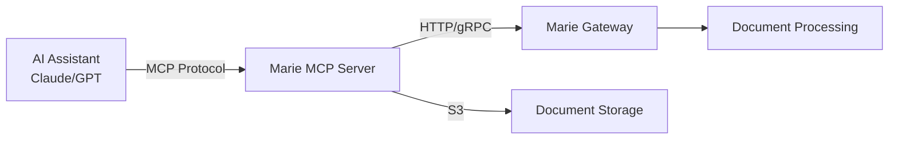

# AI Assistant Integration

Integrate Marie AI's document intelligence capabilities directly into AI assistants using the Model Context Protocol (MCP).

## Supported Platforms

### Claude Desktop
**Best for:** Interactive document processing with natural language

Claude Desktop natively supports MCP servers, making it perfect for ad-hoc document processing tasks.

[Get Started →](/docs/getting-started/mcp-quickstart)

### LangChain
**Best for:** Building AI applications with document processing

Integrate Marie AI tools into your LangChain agents for autonomous document processing workflows.

```python
from langchain_mcp_adapters.tools import load_mcp_tools

marie_tools = await load_mcp_tools(
    StdioServerParameters(command="uvx", args=["marie-mcp"])
)
```

[Learn More →](/docs/guides/mcp-server#integration-with-langchain)

### OpenAI Agents SDK
**Best for:** OpenAI-powered document processing agents

Use Marie AI with the OpenAI Agents SDK for GPT-powered document intelligence.

```python
from agents.mcp import MCPServerStdio

marie_server = MCPServerStdio(command="uvx", args=["marie-mcp"])
agent = Agent(tools=marie_server.get_tools())
```

[Learn More →](/docs/guides/mcp-server#integration-with-openai-agents)

## What is MCP?

The [Model Context Protocol (MCP)](https://modelcontextprotocol.io/) is an open standard that enables AI assistants to securely access external tools and data sources.

### How It Works



1. **AI Assistant** communicates with Marie MCP Server via STDIO
2. **MCP Server** translates requests to Marie API calls
3. **Marie Gateway** processes documents asynchronously
4. **Results** returned to AI assistant via MCP

### Benefits

- **Natural Language Interface**: "Extract text from invoice.pdf"
- **No Code Required**: Use plain English to process documents
- **Async Job Management**: Track progress, cancel jobs, download results
- **System Monitoring**: Check capacity, view active executors
- **Lightweight**: Only ~5MB, no heavy dependencies

## Available Capabilities

### Document Processing
- **OCR Text Extraction**: Extract text with layout preservation
- **Template-Based Extraction**: Structured data extraction with predefined templates
- **Multi-format Support**: PDF, TIFF, JPEG, PNG, Office documents

### Job Management
- **Submit Jobs**: Create processing jobs with SLA tracking
- **Monitor Progress**: Real-time job status updates
- **Control Execution**: Stop/delete jobs as needed
- **Download Results**: Retrieve processed results from S3

### System Monitoring
- **Health Checks**: Verify gateway availability
- **Capacity Monitoring**: Check available processing slots
- **Executor Status**: View active document processors
- **Debug Information**: Access scheduler diagnostics

## Quick Start

### 1. Install

```bash
uv pip install marie-mcp
```

### 2. Configure

```bash
export MARIE_BASE_URL=http://localhost:5000
export MARIE_API_KEY=your-api-key
export AWS_ACCESS_KEY_ID=your-aws-key
export AWS_SECRET_ACCESS_KEY=your-aws-secret
```

### 3. Use with Claude Desktop

Add to `claude_desktop_config.json`:
```json
{
  "mcpServers": {
    "marie-ai": {
      "command": "uvx",
      "args": ["marie-mcp"],
      "env": { /* your config */ }
    }
  }
}
```

### 4. Start Processing

In Claude:
```
Extract text from invoice.pdf with ref_id "invoice_001"
```

[Complete Quick Start Guide →](/docs/getting-started/mcp-quickstart)

## Use Cases

### Document Workflows
- Invoice processing and data extraction
- Medical form data capture
- Contract analysis and key term extraction
- Receipt OCR and expense categorization

### Batch Processing
- Process folders of documents
- Track multiple jobs simultaneously
- Automated result aggregation

### System Management
- Monitor processing capacity
- Track job completion rates
- Debug processing issues
- View active executors

## Documentation

- **[Quick Start Guide](/docs/getting-started/mcp-quickstart)** - Get running in 5 minutes
- **[Complete MCP Guide](/docs/guides/mcp-server)** - Full documentation
- **[API Reference](/docs/api)** - Marie AI API details
- **[GitHub Package](https://github.com/marieai/marie-ai/tree/main/packages/marie-mcp)** - Source code and examples

## Example Conversations

### With Claude Desktop

**You:** "What's the current system status?"

**Claude:** *Uses `health_check()` and `get_capacity()` tools*

"The Marie AI system is healthy. There are 8/10 processing slots available (80% capacity). Active executors include: extractor, classifier, and ner_extractor."

---

**You:** "Extract text from my invoice at ~/invoice.pdf"

**Claude:** *Uses `extract_document_ocr()` tool*

"I've submitted an OCR extraction job (job_abc123). The document has been uploaded to S3 and processing has started. Would you like me to check the status?"

---

**You:** "Yes, check the status"

**Claude:** *Uses `get_job_status()` tool*

"The job is currently running (50% complete). It should finish in about 30 seconds. Shall I download the results when it's done?"

## Community Examples

Check out community-contributed examples:

- [Invoice Processing Workflow](https://github.com/marieai/marie-ai/tree/main/packages/marie-mcp/examples)
- [Batch Document Processing](https://github.com/marieai/marie-ai/tree/main/packages/marie-mcp/examples)
- [Custom LangChain Agent](https://github.com/marieai/marie-ai/tree/main/packages/marie-mcp/examples)

## Support

Need help integrating Marie AI with your AI assistant?

- 💬 [GitHub Discussions](https://github.com/marieai/marie-ai/discussions)
- 🐛 [Report Issues](https://github.com/marieai/marie-ai/issues)
- 📧 [Email](mailto:support@marieai.co)

---

**Ready to get started?** [Follow the Quick Start Guide →](/docs/getting-started/mcp-quickstart)
