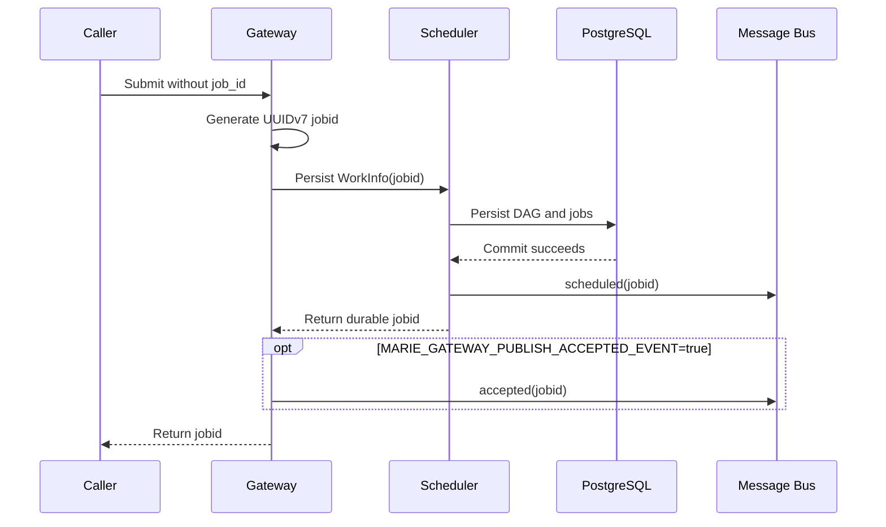
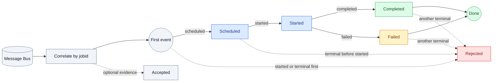
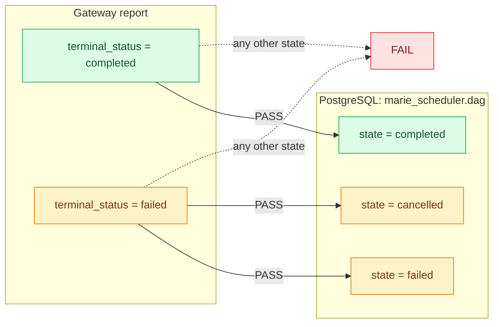
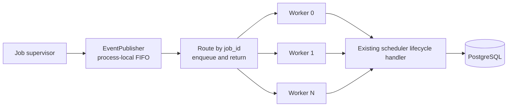
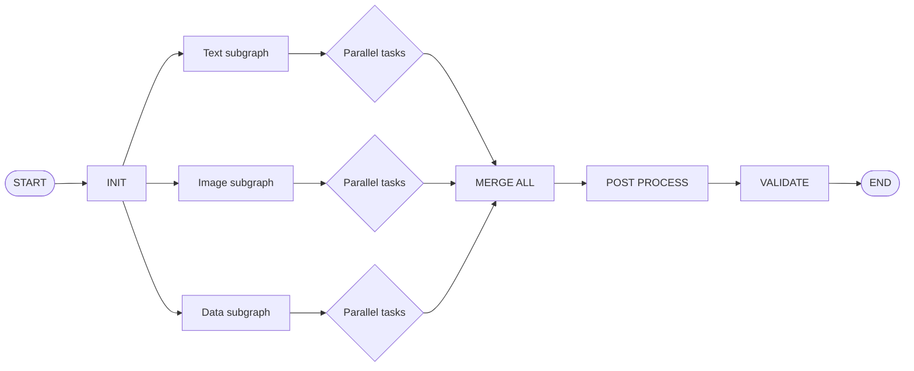

# Scheduler Correctness and Gateway Qualification Runbook

Use this runbook to create a persistent scheduler corpus, verify its PostgreSQL
state, execute a live gateway smoke run, and correlate gateway observations with
the authoritative database state.

The workflow uses the PostgreSQL client inside `marie-psql-server`. A host
installation of `psql` is not required. The Python stress tools connect to the
published PostgreSQL port configured in `scheduler-db.config.example.json`.

## What This Workflow Proves

The workflow has two separate gates:

1. **Database correctness** checks the persistent scheduler corpus with
   read-only, run-scoped PostgreSQL queries.
2. **Gateway qualification** submits real work, consumes Message Bus lifecycle
   events, captures gateway capacity, and compares those observations with
   PostgreSQL.

A database-only pass is not a full gateway qualification. In the default
`corpus` scope, the four gateway checks are skipped when no gateway report is
supplied and do not affect the database-only result. In `gateway` scope,
accepted identities, complete event lifecycles, terminal outcomes, and the
post-drain capacity snapshot are mandatory; missing evidence fails the run.

## Evidence Sources

| Check | Evidence source | PostgreSQL data used |
| --- | --- | --- |
| `gateway_scheduler_identity` | Successful submission `job_id` values in the gateway report | `marie_scheduler.dag.id` and run-tagged jobs belonging to that DAG |
| `gateway_event_order` | Message Bus event arrival order stored in `jobs[].raw_events` | None |
| `gateway_terminal_agreement` | `jobs[].terminal_status` in the gateway report | `marie_scheduler.dag.state`, joined through `job.dag_id` |
| `post_drain_capacity` | Gateway `GET /api/capacity` snapshot | None |

The gateway report is a JSON artifact. It is not inserted into PostgreSQL.
Although the scheduler schema contains event tables, these four gateway checks
do not query those tables.

### Gateway scheduler identity

The public gateway `job_id` is the scheduler DAG ID. The verifier requires each
accepted ID to resolve to one DAG with at least one job tagged with the same run
ID:

```sql
SELECT
    submitted.id,
    COUNT(DISTINCT dag.id) AS dag_matches,
    COUNT(job.id) FILTER (
        WHERE job.data->'metadata'->>'stress_run_id' = <run-id>
    ) AS tagged_jobs
FROM unnest(<gateway-job-ids>) submitted(id)
LEFT JOIN marie_scheduler.dag dag ON dag.id::text = submitted.id
LEFT JOIN marie_scheduler.job job ON job.dag_id = dag.id
GROUP BY submitted.id;
```

### Submission event semantics

The gateway generates the canonical UUIDv7 `job_id`; callers do not provide or
override it. The gateway returns that ID and every lifecycle event carries it
in the Message Bus `jobid` field.

`accepted` and `scheduled` describe different boundaries:

- `accepted` is an optional gateway notification emitted only after the DAG and
  its jobs commit to PostgreSQL. It is disabled by default.
- `scheduled` is the scheduler notification for the same durable-commit
  boundary. An admission wake is best effort after commit; periodic scheduler
  polling remains the repair path if that wake fails.

Enable the optional acceptance event before starting the gateway:

```bash
export MARIE_GATEWAY_PUBLISH_ACCEPTED_EVENT=true
```

The flag does not alter the durable acknowledgement boundary or change the
meaning of `scheduled`.



The diagram shows state ownership, not guaranteed observation order. HTTP and
the Message Bus are independent transports, so lifecycle notifications can be
observed before the HTTP response reaches the caller.

### Gateway event order

The gateway stresser consumes Message Bus events and correlates lifecycle state
only by `jobid`. When an event arrives before its submission response, the
stresser buffers it under `jobid` and replays it after the response returns that
exact ID. `ref_id` remains document metadata and is never a lifecycle
correlation fallback.

The optional `accepted` event is retained in raw event evidence but does not
participate in the required lifecycle ranks. During strict qualification, the
gateway reliability and correctness checks reject:

- `started` before `scheduled`
- a terminal event before `started`
- both `completed` and `failed`
- more than one terminal event

This check validates observed Message Bus event order; it is not a database query.



### Gateway terminal agreement

The verifier joins every gateway terminal job ID to its DAG and compares the
gateway result with the durable DAG state:

- gateway `completed` requires database DAG `completed`
- gateway `failed` requires database DAG `failed` or `cancelled`



### Post-drain capacity

After the workload drains, the gateway stresser calls `/api/capacity` and
records `used` and `holder_count`. Full qualification requires both values to
be zero and the snapshot itself to have `ok: true`.

Capacity totals are cluster-wide. Run qualification on an otherwise idle
gateway so unrelated work does not produce a false failure.

## Prerequisites

Run commands from the Marie-AI repository root:

```bash
cd ~/dev/marieai/marie-ai
```

Required services:

- `marie-psql-server`, published on `127.0.0.1:5432`
- gateway HTTP API, normally on `127.0.0.1:51000`
- a running scheduler monitoring the target queue
- every executor required by the selected planner
- Message Bus for lifecycle events
- MinIO/S3 and at least one usable input asset

Inspect the running containers:

```bash
docker ps --format 'table {{.Names}}\t{{.Ports}}\t{{.Status}}'
```

If the database requires a password, keep it outside repository configuration:

```bash
export PGPASSWORD='<database-password>'
```

Do not put database, gateway, Message Bus, or S3 passwords in a committed file.

## 1. Verify PostgreSQL and the Optional Diagnostic Helper

Verify the database connection through the container:

```bash
docker exec marie-psql-server \
  psql -U postgres -d postgres -v ON_ERROR_STOP=1 \
  -c "SELECT current_database(), current_user, current_setting('server_version');"
```

The attempt and terminal checks use an optional HA/stress helper. Install it
explicitly; it is not part of the core scheduler schema contract:

```bash
docker exec -i marie-psql-server \
  psql -U postgres -d postgres -v ON_ERROR_STOP=1 \
  < config/psql/high-availability/scheduler_attempt_invariant_checks.sql
```

Confirm that it exists:

```bash
docker exec marie-psql-server \
  psql -U postgres -d postgres -v ON_ERROR_STOP=1 \
  -c "SELECT n.nspname, p.proname, pg_get_function_identity_arguments(p.oid) FROM pg_proc p JOIN pg_namespace n ON n.oid = p.pronamespace WHERE n.nspname = 'marie_scheduler' AND p.proname = 'scheduler_attempt_invariant_checks';"
```

The stress tools do not require or enforce a particular scheduler schema
version. They validate the database objects they actually use.

## 2. Plan and Seed the Persistent Corpus

Preview the intended mutation:

```bash
python tools/stress/scheduler_db_stresser.py plan \
  --config tools/stress/scheduler-db.config.example.json \
  --report /tmp/scheduler-scale-v1-plan.json
```

Seed the 1,000-DAG checkpoint:

```bash
python tools/stress/scheduler_db_stresser.py seed \
  --config tools/stress/scheduler-db.config.example.json \
  --target-dags 1000 \
  --report /tmp/scheduler-scale-v1-1k.json
```

Rerunning the seed command resumes from the manifest high-water mark. It does
not need a schema-transition flag.

## 3. Run Database-Only Correctness

```bash
python tools/stress/scheduler_correctness.py \
  --run-id scheduler-scale-v1 \
  --config tools/stress/scheduler-db.config.example.json \
  --sample-limit 50 \
  --report /tmp/scheduler-scale-v1-correctness.json
```

This verifier is read-only and refuses an unknown run ID. It checks:

- manifest, DAG, job, and search-projection cardinality
- logical identity and run scoping
- serialized and normalized dependency agreement
- dependency level, root/leaf, and start-order invariants
- attempt identity and lease validity
- duplicate, conflicting, stale, or missing terminal outcomes
- terminal DAG consistency and retained terminal leases

For a `single` graph with one node per DAG, dependency checks have little edge
coverage. Use `chain`, `fanout`, `diamond`, or `mixed` corpora for meaningful
dependency qualification.

## 4. Verify Gateway Readiness

Use the existing gateway API key only in the local shell:

```bash
export GATEWAY_API_KEY='<gateway-api-key>'
```

Check scheduler queue visibility:

```bash
curl -fsS \
  -H "Authorization: Bearer $GATEWAY_API_KEY" \
  http://127.0.0.1:51000/api/debug \
  | python -m json.tool
```

Check executor capacity:

```bash
curl -fsS \
  -H "Authorization: Bearer $GATEWAY_API_KEY" \
  http://127.0.0.1:51000/api/capacity \
  | python -m json.tool
```

Before submission, confirm:

- `mock_executor_a` through `mock_executor_h` are present
- every required executor has positive configured and available capacity

`known_queues` is a diagnostic snapshot, not a readiness requirement. The
scheduler creates a missing queue during submission and then adds it to
`known_queues`.

Do not use `--skip-preflight` for qualification.

## 5. Prepare the Gateway Runtime Configuration

Use the repository's canonical gateway stress configuration:

```bash
python -m json.tool \
  tools/stress/gateway-e2e.config.json \
  >/dev/null
```

The stresser commands below use `tools/stress/gateway-e2e.config.json`
directly. Keep real gateway, Message Bus, and S3/MinIO credentials out of the
tracked file. Do not paste populated credentials into a ticket, report, or chat
transcript.

Use `--mock-process-time` to separate dependency-order correctness from the
slow executor timing profile. The override is copied into every mock executor
request. A small fixed value preserves dispatch, capacity, and dependency
behavior without inheriting the configured 1-8 second mock delays. Omit the
option when testing SLA, timeout, or sustained-capacity behavior.

Run the gateway with `config/service/mock/marie-mock-scheduler-test.yml`. That
configuration registers the `mock_parallel_subgraphs` planner and
`mock_executor_a` through `mock_executor_h`. The scheduler creates the queue on
first submission if it is not already known.

### Enable a shared scheduler trace

For a short throughput investigation, set the same trace environment on the
gateway and every mock executor process before starting them:

```bash
export MARIE_SCHEDULER_TRACE_ENABLED=true
export MARIE_SCHEDULER_TRACE_PROFILE=full
export MARIE_SCHEDULER_TRACE_PATH=~/tmp/marie-scheduler-trace.jsonl
```

Restart the gateway and all eight mock executors after setting the variables.
The gateway setting alone cannot capture executor receipt, service, callback,
or slot-release events. After the run, verify propagation and split terminal
feedback latency:

```bash
python tools/stress/analyze_scheduler_trace.py \
  ~/tmp/marie-scheduler-trace.jsonl \
  --report
```

The `Trace Coverage` section must contain non-zero supervisor and executor
counts. `Terminal Status Event Handoff` separates executor completion,
supervisor send-task completion, final status lookup, internal status-publisher
queueing, scheduler-event queueing, scheduler handler entry, and durable
terminal acceptance. The analyzer keys queue events to the scheduler process
ID so executor-local publishers cannot be mistaken for the scheduler's
publisher.



The same `job_id` always routes to the same worker, which preserves its
`PENDING` → `RUNNING` → terminal order. Different jobs can progress on
different workers. Both boundaries are bounded: the job manager's internal
publisher applies backpressure instead of dropping status events, while the
scheduler processor defaults to eight workers and 1,024 queued events.
Override those defaults with
`job_event_worker_count` and `job_event_queue_size` in the scheduler section.
The trace must show equal non-zero `scheduler event processor` enqueued,
dequeued, and processed counts, with `failed=0`.

The same section reports the randomized job-monitor sleep and terminal
observation. Those values are diagnostic comparisons: the monitor reads job
status and exits after observing a terminal state, but it does not publish the
scheduler terminal callback. `Terminal Feedback` then separates durable
terminal acceptance, DAG resolution, scheduler wake, and the next global
candidate snapshot. The last measurement is a scheduling-loop proxy: several
terminal events can share the same next candidate snapshot.

`gateway_dispatch_confirmed` is retained for report compatibility, but its
meaning is supervisor pre-send admission. Use `executor_request_received` or
the supervisor worker-ack boundary when proving downstream receipt.

Trace output redacts `api_key` and `project_id`. Do not distribute traces made
with older code without reviewing them for sensitive fields.

## 6. Run Live Multi-Node Correctness

Do not reuse the database-corpus run ID. A live gateway run has its own DAG
cohort and does not use a `marie_stress.run_manifest` row.



### Successful fan-out and fan-in

This run requires every DAG to complete. The correctness verifier scopes
PostgreSQL through the accepted gateway DAG IDs and requires each persisted
graph to contain multiple nodes, a fan-out, and a fan-in:

```bash
python tools/stress/gateway_e2e_stresser.py \
  --config tools/stress/gateway-e2e.config.json \
  --protocol http \
  --gateway-host 127.0.0.1 \
  --http-port 51000 \
  --s3-uri s3://dummy/stress.txt \
  --job-count 5 \
  --run-id scheduler-mock-parallel-success-v1 \
  --job-name mock_parallel_subgraphs \
  --planner mock_parallel_subgraphs \
  --required-executor mock_executor_a \
  --required-executor mock_executor_b \
  --required-executor mock_executor_c \
  --required-executor mock_executor_d \
  --required-executor mock_executor_e \
  --required-executor mock_executor_f \
  --required-executor mock_executor_g \
  --required-executor mock_executor_h \
  --mock-failure-rate 0 \
  --mock-failure-mode exception \
  --submit-concurrency 2 \
  --submit-rate 1 \
  --terminal-timeout 600 \
  --min-submission-acceptance-pct 100 \
  --min-terminal-completion-pct 100 \
  --max-event-timeout-jobs 0 \
  --max-open-jobs 0 \
  --require-event-order \
  --max-duplicate-terminal-events 0 \
  --max-conflicting-terminal-events 0 \
  --max-retained-jobs 5 \
  --job-jsonl /tmp/scheduler-mock-parallel-success-v1.jsonl \
  --verify-correctness \
  --correctness-config tools/stress/scheduler-db.config.example.json \
  --correctness-report /tmp/scheduler-mock-parallel-success-v1-correctness.json \
  --report /tmp/scheduler-mock-parallel-success-v1-gateway.json
```

### Forced failure and downstream blocking

This run forces every DAG to fail at its first executable mock node. It proves
that transitive descendants never start, the DAG becomes terminal, and pending
downstream jobs are cancelled with `cancel_reason=dag_failed`:

```bash
python tools/stress/gateway_e2e_stresser.py \
  --config tools/stress/gateway-e2e.config.json \
  --protocol http \
  --gateway-host 127.0.0.1 \
  --http-port 51000 \
  --s3-uri s3://dummy/stress.txt \
  --job-count 3 \
  --run-id scheduler-mock-parallel-failure-v1 \
  --job-name mock_parallel_subgraphs \
  --planner mock_parallel_subgraphs \
  --required-executor mock_executor_a \
  --required-executor mock_executor_b \
  --required-executor mock_executor_c \
  --required-executor mock_executor_d \
  --required-executor mock_executor_e \
  --required-executor mock_executor_f \
  --required-executor mock_executor_g \
  --required-executor mock_executor_h \
  --mock-failure-rate 0 \
  --mock-failure-mode exception \
  --force-failure-every 1 \
  --submit-concurrency 1 \
  --submit-rate 1 \
  --terminal-timeout 300 \
  --min-submission-acceptance-pct 100 \
  --min-terminal-completion-pct 0 \
  --max-event-timeout-jobs 0 \
  --max-open-jobs 0 \
  --require-event-order \
  --max-duplicate-terminal-events 0 \
  --max-conflicting-terminal-events 0 \
  --max-retained-jobs 3 \
  --job-jsonl /tmp/scheduler-mock-parallel-failure-v1.jsonl \
  --verify-correctness \
  --correctness-config tools/stress/scheduler-db.config.example.json \
  --correctness-report /tmp/scheduler-mock-parallel-failure-v1-correctness.json \
  --report /tmp/scheduler-mock-parallel-failure-v1-gateway.json
```

`--verify-correctness` invokes `scheduler_correctness.py --scope gateway` after
the workload drains. The parallel mock planner automatically makes
`parallel_graph_topology` mandatory. A report containing force-failed jobs also
makes `forced_failure_propagation` mandatory.

Keep `--max-retained-jobs` greater than or equal to `--job-count` for a bounded
smoke run. Otherwise, the final `jobs` array can contain only a retained subset,
and gateway-scoped correctness refuses the incomplete report.

### Larger fixed-timing correctness run

Use a small fixed mock processing time when the goal is to validate a large DAG
cohort rather than the configured SLA and timeout delays. This run submits 250
DAGs, representing 6,000 jobs and 8,500 dependency edges:

Fixed timing does not impose an order on independent sibling nodes. Correctness
requires every dependency to complete before its child starts; parallel siblings
may finish in either order.

```bash
python tools/stress/gateway_e2e_stresser.py \
  --config tools/stress/gateway-e2e.config.json \
  --protocol http \
  --gateway-host 127.0.0.1 \
  --http-port 51000 \
  --s3-uri s3://dummy/stress.txt \
  --job-count 250 \
  --run-id scheduler-mock-parallel-250-fixed-v1 \
  --job-name mock_parallel_subgraphs \
  --planner mock_parallel_subgraphs \
  --required-executor mock_executor_a \
  --required-executor mock_executor_b \
  --required-executor mock_executor_c \
  --required-executor mock_executor_d \
  --required-executor mock_executor_e \
  --required-executor mock_executor_f \
  --required-executor mock_executor_g \
  --required-executor mock_executor_h \
  --mock-process-time 0.05 \
  --mock-failure-rate 0 \
  --mock-failure-mode exception \
  --submit-concurrency 16 \
  --submit-rate 10 \
  --timeout 60 \
  --terminal-timeout 1800 \
  --min-submission-acceptance-pct 100 \
  --min-terminal-completion-pct 100 \
  --max-event-timeout-jobs 0 \
  --max-open-jobs 0 \
  --require-event-order \
  --max-duplicate-terminal-events 0 \
  --max-conflicting-terminal-events 0 \
  --max-retained-jobs 250 \
  --max-metric-samples 250 \
  --job-jsonl /tmp/scheduler-mock-parallel-250-fixed-v1.jsonl \
  --debug-sample-interval 5 \
  --progress-interval 10 \
  --live-report /tmp/scheduler-mock-parallel-250-fixed-v1-live.json \
  --verify-correctness \
  --correctness-timeout 600 \
  --correctness-config tools/stress/scheduler-db.config.example.json \
  --correctness-report /tmp/scheduler-mock-parallel-250-fixed-v1-correctness.json \
  --report /tmp/scheduler-mock-parallel-250-fixed-v1-gateway.json
```

Do not run the fixed-timing and slow-capacity cohorts concurrently. They share
the same executor slots, so either run would invalidate the other's timing and
backlog measurements.

## 7. Evaluate the Result

Inspect both durable artifacts:

```bash
python -m json.tool \
  /tmp/scheduler-mock-parallel-success-v1-gateway.json
```

```bash
python -m json.tool \
  /tmp/scheduler-mock-parallel-success-v1-correctness.json
```

```bash
python -m json.tool \
  /tmp/scheduler-mock-parallel-failure-v1-correctness.json
```

Full gateway qualification requires:

- top-level correctness `passed` is `true`
- correctness `scope` is `gateway` and `manifest` is `null`
- all mandatory database checks pass
- `gateway_dag_scope` is `pass`
- `parallel_graph_topology` is `pass`
- `parallel_graph_topology.observed` reports 24 nodes, 34 edges, 1 root,
  1 leaf, 4 fan-out nodes, and 4 fan-in nodes for every sampled DAG
- `normalized_dependencies_match` is `pass`
- `dependency_start_order` is `pass`
- `failed_descendants_blocked` is `pass`
- the failure run's `forced_failure_propagation` is `pass`
- `gateway_scheduler_identity` is `pass`
- `gateway_event_order` is `pass`
- `gateway_terminal_agreement` is `pass`
- `post_drain_capacity` is `pass`
- no gateway check is `skipped`
- gateway `reliability.passed` is `true`
- `post_drain_capacity.ok` is `true`
- post-drain `used` and `holder_count` are zero

Do not treat top-level `passed: true` with skipped gateway checks as full E2E
qualification. Do not key automation only to the total number of checks; check
the required names and statuses because the suite can grow.

Topology evidence is bounded by `--sample-limit`. The `nodes_min`/`nodes_max`,
`edges_min`/`edges_max`, root/leaf, and fan-out/fan-in ranges always cover the
full accepted cohort. `dag_sample_truncated` reports whether `dag_sample`
contains only the first bounded subset.

## Inspect Run-Scoped Database State

Use Docker to inspect scheduler rows associated with the run:

```bash
docker exec marie-psql-server \
  psql -U postgres -d postgres -v ON_ERROR_STOP=1 \
  -c "SELECT job.id, job.dag_id, job.state AS job_state, dag.state AS dag_state, job.data->'metadata'->>'stress_run_id' AS stress_run_id, job.data->'metadata'->>'ref_id' AS ref_id FROM marie_scheduler.job job LEFT JOIN marie_scheduler.dag dag ON dag.id = job.dag_id WHERE job.data->'metadata'->>'stress_run_id' = 'scheduler-mock-parallel-failure-v1' ORDER BY job.created_on, job.id;"
```

This query shows database state only. Message Bus event order and gateway capacity
remain in the matching `/tmp/scheduler-mock-parallel-*-gateway.json` report.

The capacity check is fail-closed: `ok` must be `true`, and both `used` and
`holder_count` must be present and equal zero.
